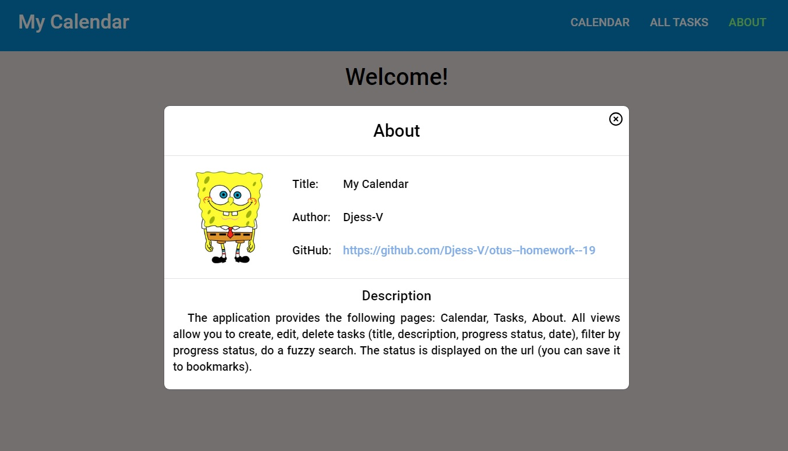
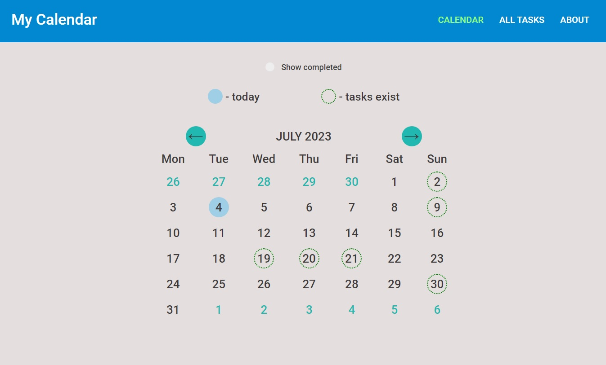
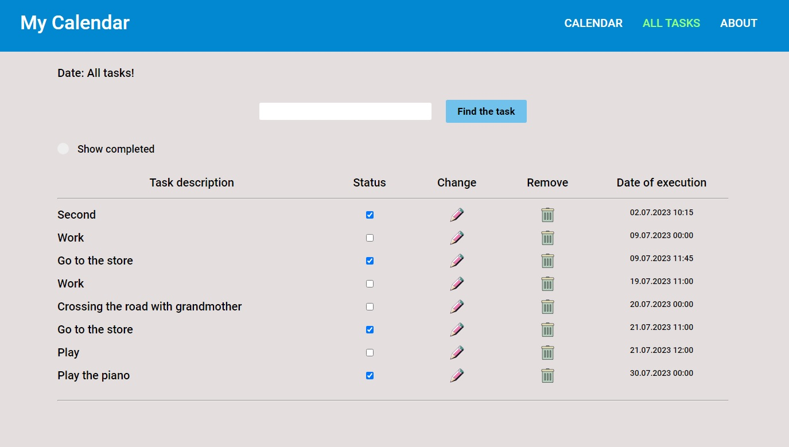

<h1 align="center">Календарь задач с поддержкой роутинга на клиенте</h1>

_**[Развёрнуто здесь](https://djess-v.github.io/otus--homework--19/)**_

---

<h2>Визуальное представление</h2>

Страница - "About"

Страница - "Calendar"

Страница - "Tasks"

<h2>Описание приложения</h2>

При открытии страницы вы увидите календарь задач с одной записью. Пройдёмся по функционалу кнопок, ограничениям и возможностям приложения:

"Create a task" - открывает модальное окно для создания новой задачи. Поле "Describe" оставлять пустым нельзя. В полях "Complete(hours)" и "Complete(minutes)" можно ввести время выполнения задачи (по умолчанию - 00:00). Поле "Tags" - можно оставить незаполненным. Теги, если вы их ввели, отображаются при наведении указателя мыши на строку описания задачи. Скрипты в данные поля ввода вводить не следует.

"Find the task" - отбор записей по описанию задачи. Будут найдены все записи, в которых встречается тот набор символов, которые вы ввели. 

Фильтр "Show completed" предназначен для выборки задач по условию их выполнения.

Задачи можно удалять, менять статус(выполненно/невыполненно) или редактировать, воспользовавшись соответствующими значками каждой задачи. При редактировании откроется модальное окно для внесения изменений. Пустая строка недопустима! Хотите удалить - воспользуйтесь кнопкой с мусорным ведром.

Все данные храняться у вас в браузере и подгружаются в store.

